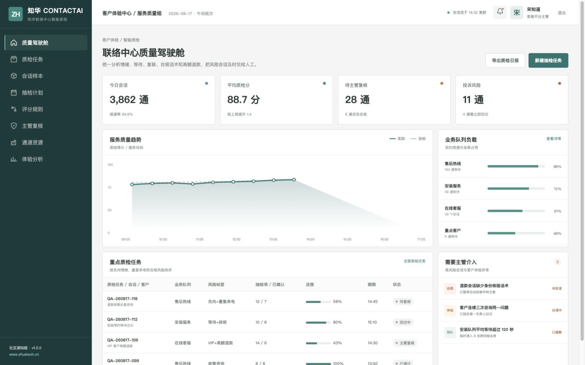
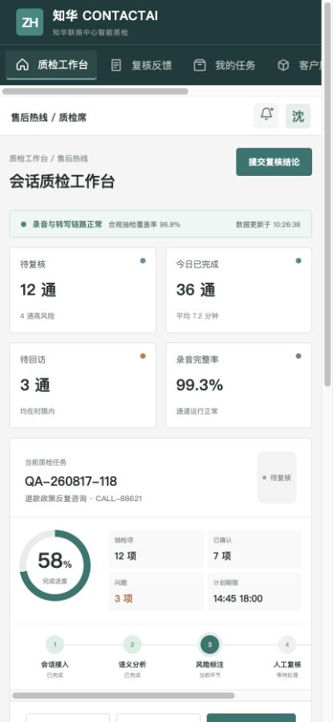

# ContactAI：联络中心智能质检社区版

面向客服主管、质检团队和一线坐席的会话质量工作台。它把情绪、等待时间、重复来电、合规话术和退款金额整理成可解释的风险队列，并明确哪些动作必须由人工确认。

**出品方：** [知华科技（上海如静知华信息科技有限公司）](https://www.zhuatech.cn/)　 **后端包名：** `cn.zhuatech.contactai`



## 不是“自动给坐席打分”

ContactAI 更重视证据与协同：系统先筛查高风险会话，质检人员核对录音和转写，主管处理合规、高额退款及投诉，最后把改进建议交回坐席。社区版不调用外部大模型，便于离线演示和规则测试。

核心分析接口：`POST /api/ai/contact/analyze`。



## 功能组成

- 会话接入、AI 初检、风险标签、人工复核、回访闭环
- 负向情绪、等待超时、重复联系、合规话术和高额退款规则
- 录音通道、转写服务、在线客服和坐席健康状态
- 管理端质量趋势与队列负载，H5 端复核反馈与主管升级
- JWT 权限、MySQL/Flyway、H2 测试和 Docker Compose

## 启动演示界面

```bash
cd frontend
npm install
npm run dev:demo
```

浏览器访问 `http://localhost:5173`。主管端使用 `planner / Demo@2026`，质检端使用 `operator / Demo@2026`。所有客户、坐席、退款和会话均为虚构演示内容。

更多资料：[API](docs/api.md) · [系统架构](docs/architecture.md) · [数据设计](docs/database.md) · [部署方式](deploy/README.md)

---

## 个人非商业许可

本工程仅能用于个人、非商业学习交流，**不得商用**。企业内部使用、真实客户数据处理、生产部署、SaaS、实施交付、收费服务、品牌替换或二次销售，须提前取得上海如静知华信息科技有限公司书面授权，以 [LICENSE](LICENSE) 为准。

联络中心系统、智能客服、会话质检、私有化 AI、软件外包及深度开发定制，请访问[知华科技官网](https://www.zhuatech.cn/)或通过微信咨询：

| 方案与技术咨询 | 商业授权与项目定制 |
| --- | --- |
|  |  |

搜索关键词：联络中心智能质检、客服质检系统、呼叫中心 AI、会话分析、客户体验管理、Java Vue 源码、知华科技。

<!-- Copyright 2026 上海如静知华信息科技有限公司 -->
